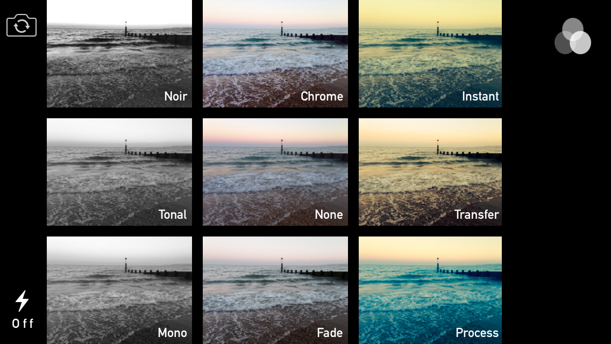

# Human Computer Interaction
 
---
## 5th Lecture

>	Content
> -
> - Seven Stages of Action
> - Mappings
> - Constraints
> - Conceptual Knowledge
> - Knowledge of the world
> - Errors
> - Design Implementations

### Fundamental Concepts _(Norman)_
- Visibilty and Affordance
	- _can the user tell (by looking) what the state of the system is and which actions are available?_ 
- Natural Mappings
	- _Is it possible to determine Cause and Effect?_ 
- Conceptual Mappings
	- _Is the user able to predict how actions affect the system_
- Feedback
	- _Does the user receive full (and continious) feedback about the (full) result of actions?_

### Seven stages of Action
>	Simplified model
>	.png)
>

**Goal » Execution**:

-	Problem oriented _(I need light)_
-	Task oriented _(operate the light switch)_

>	Often Problem oriented.
>	Needs to be translated to Task-Orientation
 
	Goal
	 ¬ Intention
	  ¬ Action Sequence
	   ¬ Execution

**Evalation » Goal**

>	Evaulation:
>		
>	- Perceive Result
>	- Interpret it
>	- Compare to Goal
	
	Perception
	 ¬ Interpretation
	  ¬ Comparision
	  	¬ Goal

>	Complete Model
>	

### Conceptual Model
- Users internal Model/ understanding of how a system (might) work
- enables us to predict effects of our actions
 
> **Design Goal:**
> Provide the User with an intuitive Conceptual Model

### Feedforward
- Show outcome before action is performed
> Example:
> 	

-
# Errors
- Mistakes
- Slips 

## Mistakes
_Wrong Goal » Correct Action_

- Hard to Detect
- Often Major Problem
- Result of Decision

> Reason: False Conceptual Model

## Slips
_Correct Goal » Wrong Execution_

- Everyday errors
- easy to discover
- occur in *skilled behavour*

> Reason: Lack of attention, bored etc.  

#### Types of slips
> - Capture Error
> 	- Mistaking a smiliar action for another one
> 	- e.g. Driving to work on Sunday
> 
> - Description Error
> 	- Intention not detailed enough
> 	- Correct Action on wrong object
>	- Often occur when *similiar* Objects are *physically close* to each other
>
> - Data Driven Erros
> 	- Arriving sensory data intrudes into ongoing action sequence, causing
unintended behavior
>	- e.g. Saying "my Bike is from Audi", because you saw an Audi
>
> - Associative Activision Erros 
> 	- Internal association triggers wrong action
> 	- e.g. Answering the Phone saying "Come in"
> 
> - Loss of Activation Error
> 	- Forgetting Goal while performing
> 
> - Premature Conclusion Error
> 	- Forgetting to complete action sequence because main part of goal is accomplished
> 
> - Mode Errors
> 	- Triggering the wrong action because the device is in a different mode than expected
>	- e.g. Vim 

### Detecting Slips
Easy, but requires Feedback

User automates Actions, ignores Feedback

> Solution: Reversible Actions

## Designing for Erros
- Assume all possible Errors will be made _(Murphy's Law)_
- Use **Constraints**, Minimize possible Errors
- Easy to detect **(visibility)**
- Easy to reverse *(undo)*
- Observe People using your System

-
# Golf of Execution/Evaluation
- Golf of Execution
	-	Uncertainty about *how to perform* intention
- Golf of Evaluation	
	-	Uncertainty about whether or not *result was reached*

-
# Mappings
> 	Good Mappings are natural & use cultural standarts
>  
> - Understood fast
> - Remebered with ease
> - Used with Confidence

- Spatial Analogies
	- arange Controls like their real world counter parts
- Perceptual Analogies
	- the Controls look like the thing itself
	- "The Voodoo Principle"

### Constraints
> The *inverse* of affordances

- Limit the ways of usage
- Guides User

> Types
> 
> - Physical
> - Semantic
> - Logical
> - Cultural
> 
| Physical | Semantic | Logical | Cultural |
|----------|----------|---------|----------|
|Limit physical Operations. (e.g. USB Stick only fits one way) | Use common knowledge of the real world to determine the meaning of situation in context (e.g. where does the head of the leog figure belong?)| if only one port is free, than this must be the right one| Red means Stop

### Seven Principles of Good Design
- Make things **visible** _bridge golf of execution & evalutation_
- Use **natural mappings**
- Use **Constraints**
- **Simplify Task** Structure
- Design for *Error*
- When all else fails **Standardise** 

### Seven Principles of Bad Design
- Make things *invisible*
- No *feedback*
- Nonobvious Commands and arbitrary mappings between them
- Use tech speak & abbrv.
- Be impolite *especially in error messages*
- Make operations potentially fatal, *no Undo*
### What are the (dis-) advantages of *Serif-Fonts*?
### What are standart Typography recommendations?
(important)
### What are *Additive* and *Substitive* Dimensions of Mappings?
