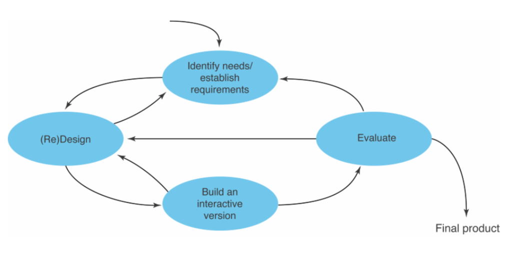
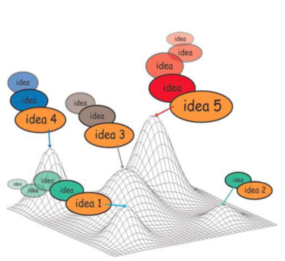

# Human Computer Interaction

---
## 6th Lecture

### 10 Prinziples of Good Design
> Good Design ist
> 
> -   innovativ
> -   brauchbar
> -   ästhetisch
> -   verständlich
> -   unaufdränglich
> -   ehrlich
> -   langlebig
> -   konsequent _bis ins letzte Detail_
> -   umweltfreundlich
> -   so _wenig_ Design wie möglich

-
# What is *Iterative Design*?
-   Several Iterations nessecary
- Fix _major_ Design Problems first, getting _increasingly smaller_
- With each Iteration
    - Design becomes more concrete and precise
    - Implementation gets more detailed
    - Analysis and User Feedback focus on smallers Problems

### What are the pros and cons of *Iterative Design*?
|pro|con|
|---|---|
|Catches errors|Time intesitive|
|Results are easy to interpret|Small fixes require new iterations|

### Basic Activities of Interactive Design

> - Identify needs
> - establish requirements
> - develop _alternative_ designs
> - Build Prototypes
> - Evaluate designs

TODO
### What are the *first 2 Questions* in the Design Process?
- Identify needs/establish requirements
- Who will the users be/what will they be doing with the system

-
# Users
>   you woun't know the _wants and needs_ until you've _asked_
>   Methods
> -
> 
> - Talk (with User)
> - Visit, observe (casually)
> - Have users think aloud
> - use surveys and questionnaires

-
# Personas
_short profiles of typical user_

> Building Personas
> -
> 
> - from individual Interviews
> - Synthesize fictious user from different real one
> - (develop) *multiple* personas

Base Design decision on needs of personas

Benefits

- Communicate User Characteristics
- Avoid *elastic* users
- Avoid *self-referencial* Design
- Avoid Design for Edge Cases

-
# Requirements

- find out *needs*
- Establish Requirements

> Types of Requirements
> 
> - Functional Requirement
> 	- _What the product should do_
> - Non functional Requirements
>   - _Constraints on the product_

-
# Task Centered Design
- Formulate real. representative Tasks
- Tasks should cover main system functionality

> (Calender) "Enter meeting with a collegue"
>
> (Editing) "Make Photo more lively"

-
#Scenarios
> **Stories** about people doing *activities* in *context* using *technology*

- Narrative description of user activity/expirience when performing task

### Scenario Perspective
_Users view of **what** happens and **why** it happens_

- what Activities were taken
- Why were activities taken 

» Users expectations about the system

> opens up design process to intended users
> 
> accessible to all stakeholders

-
# Initial Design Techniques

## Brainstorming
_collect as many ideas as possible_

- quantity not quality
- 5-10 mins.

## Brainwriting
- on paper, fill one row with 3 ideas
- pass on paper
- repeate _(5 times)_

## Getting the Design right vs. Getting the right Design
- Avoid Local Hill
- Explore diffent ideas

## Parallel Design
_Expolore Ideas independently, merge then_

-
# Concept Development
_What is the Big Idea?_

- **What Problem** is the system trying to solve
- **who** has the problem?

> Develop a **tagline**, a statement of what your project is about

## Sketching
_early in design process_

- visualize ideas
- communicate ideas

## Technique 10 plus 10
- create 10 diverse designs
- Sketch 10 details
- present them

-
# Storyboarding
- Sequence of Sketches
- Describe Task showing Enviroment/User

> Why? Overview of Interactions

Should be done *after* describing task textually 
