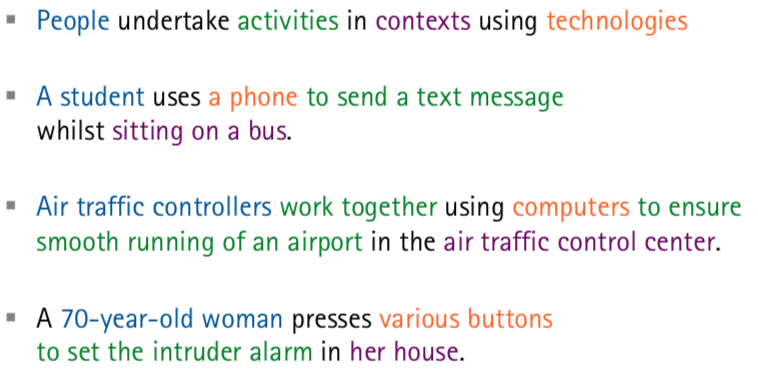

# 7th Lecture

-
# Interviews
> Key aspects
> -
> 
> - Clarify Purpose
> - How to analyze data
> - Whom to ask
>   - protect privacy
>   - consent form
> - Triangulate (more than one approach)
> - Refine Questions

## Types of Interviews
- Structured
	- tightly scripted
	- easy to clarify aspects
	- replicable 
- Unstructed
	- when little info available before
	- rich
- Semi Strucutred
	- Script merely guiding
	- free to explore
	- replicable + useful insights

> ### Questions to avoid
> - Answere is the Designers Job
> - Quantitive Information
> - Hypothetical Scenario

## Running the Interview
- (Introdction)
- **Warm up**
- **Main**
- **Cool down**
- (Closure)

## Analyzing Interview
- Identify Patters
- Relation between Answers
- Repeated Meanings
- Reoccuring words

## Interview Results
_These things can be detucted from an Interview_

- Persona
	- idetify target user
- Task Profile
	- specify core functionality 
- Contextual Factors
	- Situation of usage  
- (opt)
	- improve existing System

-
# Questionnaires
- Set of Questions with answers
- Used _within_ a survey
- Can be administered to large Groups

## Designing Questionnaires
- Specify Questions
- Closed Questions (finit, discrete answer)
- Indicate **expected Time**
- Introduce with *easy* questions

-
# Observation

The **Preisle-Goetz & Le Comple** Framework

- Who is present
- What is their role
- What is happening
- When does the activity occur
- Where is it happening
- Why is it happening
- How is it organized

## PACT Analyzis
_useful starting point for Design_

- People
- Activities
- Context
- Technolodgies
 

-
# Activities and Technolodgies
Characteristics of Activities

- Frequent of infrequent
- Continuous of interruptable
- Cooperative
- Time Demand
- Well defined or vague
- Content/ Media types
- Data Input Characteristics
- Safety 